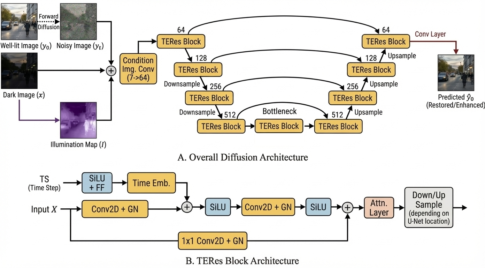

# PWC-Diff: Pixel-Weighted Conditional Diffusion for Low-Light Image Enhancement

[](https://arxiv.org/)
[](https://ieeexplore.ieee.org/)

Official implementation of **PWC-Diff**, a diffusion-based framework for low-light image enhancement guided by a lightweight pixel-wise illumination prior.

---

## Table of Contents

- [News](#-news)
- [Overview](#overview)
- [Architecture](#architecture)
- [Dataset Structure](#dataset-structure)
- [Environment Setup](#environment-setup)
- [Training](#training)
- [Generation](#generation)
- [Evaluation](#evaluation)
- [Results](#results)
- [Citation](#citation)

---

## 📢 News

**2026-05-21:** Evaluation scripts and benchmark configs are released. 💫 <br>
**2025-05-21:** Training and inference code has been released. ⭐ <br>
**2026-04-08:** PWC-Diff has been accepted at ISCC 2026. 🚀 <br>

## Overview

PWC-Diff is a conditional diffusion framework for low-light image enhancement that incorporates a computationally efficient illumination prior to guide pixel-wise restoration.

### Key Features

- Conditional diffusion framework for paired low-light enhancement
- Lightweight illumination-map guidance
- Supports LOLv1, LOLv2, SID, and other paired datasets
- Evaluated on both full-reference and no-reference benchmarks
- State-of-the-art quantitative and qualitative performance on multiple benchmarks
- Efficient inference with reduced diffusion steps

---

## Architecture

<p align="center">
  
</p>

The framework conditions the reverse diffusion process on:
1. The low-light image
2. A pixel-wise illumination map

The illumination prior guides the model toward adaptive brightness restoration while preserving image structure and details.

---

## Dataset Structure

Organize the training datasets inside the `data/` directory using the following structure:

```bash
data/
├── LOLdataset/
│   ├── train/
│   │   ├── low/
│   │   └── high/
│   └── eval/
│       ├── low/
│       └── high/
│
└── LOL-v2/
    ├── Real_captured/
    │   ├── train/
    │   │   ├── low/
    │   │   └── high/
    │   └── eval/
    │       ├── low/
    │       └── high/
    └── Synthetic/
        ├── train/
        │   ├── low/
        │   └── high/
        └── eval/
            ├── low/
            └── high/
```

Where:
- `low/` contains low-light images
- `high/` contains corresponding ground-truth normal-light images <br>

For the benchmarking no-reference datasets, their directory only includes `low/` directory.
 
---

## Environment Setup

Create a conda environment and install dependencies:

```bash
conda create -n pwc-diff python=3.11 -y
conda activate pwc-diff
pip install -r requirements.txt
```

Where:
- The used cuda version in the development phase was 12.4.
- To use a higher version update the `extra-index-url` at the begining of the [requirements](requirements.txt) file. 

---

## Training

Train the model using:

```bash
python train.py --config configs/train_config_te_ours.json
```

### Notes
- Training checkpoints are saved inside `checkpoints/`

---

## Generation

Generate enhanced images using a trained checkpoint:

```bash
python generate.py --config configs/generate_config_lolv1.json
```

### Notes
- Generated samples and logs are saved inside `outputs/`
- To generate enhanced images for other benchmarks, update the `eval_data` section inside the [generation config](configs/generate_config_lolv1.json) file

---

## Evaluation

Evaluate generated images using full-reference metrics:

```bash
python compute_scores.py --config configs/evaluate_config.json
```

Used metrics:
- PSNR
- SSIM
- LPIPS
- NIQE

### Note
- All metrics are used from the `pyiqa` package
- To use other metrics change the metric name in the `full_metrics` and `no_metrics` section in the [evaluate config](configs/evaluate_config.json) file according to the required metric name in the `pyiqa` package 


---

## Results

### Full-Reference Quantitative Performance

| Dataset | PSNR ↑ | SSIM ↑ |
|---|---|---|
| LOLv1 | 27.80 | 0.94 |
| LOLv2-R | 31.67 | 0.94 |
| LOLv2-S | 29.94 | 0.969 |
| SID | 24.10 | 0.74 |

### No-Reference Quantitative Performance

| Dataset | NIQE ↓ |
|---|---|
| DICM | 3.55 |
| LIME | 3.78 |
| MEF | 3.31 |

### Highlights

- State-of-the-art performance on LOL benchmarks
- Strong generalization on real-world low-light scenes
- Effective enhancement under extreme darkness conditions

---

## Citation

If you find this work useful, please consider citing:

```bibtex
@inproceedings{elkordi2026pwc,
  title={PwC-Diff: Pixel-Weighted Conditional Diffusion for Low-Light Image Enhancement},
  author={Elkordi, Hossam and Elmongui, Hicham G and Torki, Marwan},
  booktitle={2026 IEEE Symposium on Computers and Communications (ISCC)},
  year={2026}
}
```